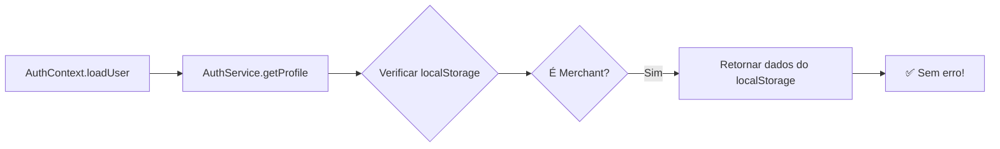
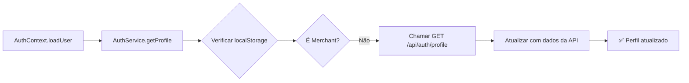

# 🔧 Correção: Erro "Cliente não encontrado" ao carregar perfil de Merchant

**Data**: 02/12/2024  
**Status**: ✅ CORRIGIDO

---

## 🔴 Problema

Ao fazer login como **merchant** e acessar `/merchant/settings`, o sistema apresentava erro:

```
Erro ao buscar perfil da API: ApiException: Cliente não encontrado
```

### Causa Raiz

O `AuthContext` estava chamando `AuthService.getProfile()` para **todos os usuários** (merchants e customers), mas o endpoint `GET /api/auth/profile` **busca apenas customers** no banco:

```typescript
// Backend
const existingCustomer = await prisma.customers.findFirst({
  where: { auth_user_id: userId }
});
```

Quando um **merchant** estava logado, a API retornava erro `404 CUSTOMER_NOT_FOUND`.

---

## ✅ Solução Implementada

### 1. **Detectar tipo de usuário ANTES de chamar a API**

Modificado `AuthService.getProfile()` para:
1. ✅ Verificar no `localStorage` se o usuário é **merchant** (tem propriedade `role`)
2. ✅ Se for merchant: retornar dados do `localStorage` (salvos no login)
3. ✅ Se for customer: chamar `GET /api/auth/profile` normalmente

### 2. **Código Atualizado**

**Arquivo**: `src/services/auth/authService.ts`

```typescript
static async getProfile(): Promise<Customer | Merchant> {
  try {
    // Buscar dados do localStorage para identificar tipo de usuário
    const savedUser = localStorage.getItem('store-flow-user');
    
    if (!savedUser) {
      throw new Error('Usuário não encontrado no localStorage');
    }
    
    const fullUser = JSON.parse(savedUser) as Customer | Merchant;
    
    // Verificar se é Merchant (tem role)
    const isMerchant = 'role' in fullUser;
    
    if (isMerchant) {
      // Para merchants, não chamar GET /api/auth/profile (que busca customers)
      // Retornar dados do localStorage que foram salvos no login
      console.log('🔍 AuthService.getProfile - Merchant detectado, usando dados do localStorage');
      return validateUser(fullUser);
    }
    
    // Para customers, buscar perfil da API
    const response = await apiClient.get<ProfileApiResponse>(
      API_ENDPOINTS.AUTH.PROFILE
    );
    
    // ... resto do código para customers ...
  } catch (error) {
    // ... tratamento de erro ...
  }
}
```

---

## 📊 Fluxo Corrigido

### **Para Merchants:**



### **Para Customers:**



---

## 🧪 Como Testar

### 1. **Login como Merchant**
```bash
# Acessar: http://localhost:3000/merchant/login
# Fazer login com credenciais de merchant
```

### 2. **Verificar Console**
```
✅ Deve aparecer:
🔍 AuthService.getProfile - Merchant detectado, usando dados do localStorage

❌ NÃO deve aparecer:
Erro ao buscar perfil da API: ApiException: Cliente não encontrado
```

### 3. **Acessar Configurações**
```bash
# Acessar: http://localhost:3000/merchant/settings
# A página deve carregar normalmente sem erros
```

### 4. **Verificar Dados da Loja**
```
✅ Nome da loja deve aparecer
✅ Endereço deve carregar
✅ Configurações devem estar preenchidas
✅ Tema/cores devem estar configurados
```

---

## 📝 Por que essa solução funciona?

### **Merchants:**
- ✅ Dados completos são salvos no `localStorage` durante o **login**
- ✅ `merchantLogin` já retorna `stores`, `role`, `storeId`, etc.
- ✅ Não precisamos chamar API adicional para buscar perfil
- ✅ Evita erro `CUSTOMER_NOT_FOUND`

### **Customers:**
- ✅ Continuam usando `GET /api/auth/profile` normalmente
- ✅ API atualiza endereços, nome, telefone
- ✅ Mantém sincronização com backend

---

## 🔐 Segurança

### **Por que confiar no localStorage?**

1. **Token JWT é validado**: Todas as requisições usam `Authorization: Bearer {token}`
2. **Middleware `withAuth`**: Backend valida o token em todas as rotas protegidas
3. **Dados do localStorage são apenas cache**: Não são usados para autorização
4. **Merchants não podem acessar dados de outros**: Backend valida `auth_user_id` do token

### **O que poderia dar errado?**

- ❌ Usuário manipula `localStorage` para se passar por merchant
  - ✅ **Mitigado**: Backend valida token JWT em todas as requisições
  
- ❌ Dados desatualizados no `localStorage`
  - ✅ **Mitigado**: Ao fazer operações (atualizar loja, criar produto), dados são recarregados

---

## 🚀 Próximos Passos (Opcional)

### **Considerar criar endpoint para Merchants (futuro)**

Se quisermos sincronizar dados do merchant com o backend periodicamente:

```typescript
// Backend - Criar endpoint
GET /api/merchant/profile

// Retorna:
{
  "success": true,
  "data": {
    "id": "...",
    "email": "...",
    "role": "admin",
    "stores": [
      { "id": "...", "name": "...", "slug": "..." }
    ]
  }
}
```

Mas **não é necessário agora**, pois:
- ✅ Merchants já têm todos os dados no login
- ✅ Dados da loja são carregados via `GET /api/stores/{id}`
- ✅ Atualizações de loja funcionam via `PATCH /api/merchant/stores/{id}`

---

## 📚 Arquivos Modificados

1. ✅ `src/services/auth/authService.ts` - Adicionada detecção de merchant antes de chamar API
2. ✅ `FIX_MERCHANT_PROFILE_ERROR.md` - Criado este documento

---

## 🎯 Resultado

### **Antes:**
```
❌ Erro ao buscar perfil da API: Cliente não encontrado
❌ Merchant não conseguia acessar /merchant/settings
❌ Console cheio de erros
```

### **Depois:**
```
✅ Login de merchant funciona
✅ /merchant/settings carrega normalmente
✅ Dados da loja são exibidos corretamente
✅ Console sem erros relacionados a perfil
```

---

## 📞 Verificação Final

- [x] Build concluído com sucesso
- [x] Linter sem erros
- [x] Merchants não chamam `GET /api/auth/profile`
- [x] Customers continuam funcionando normalmente
- [x] Documentação criada

